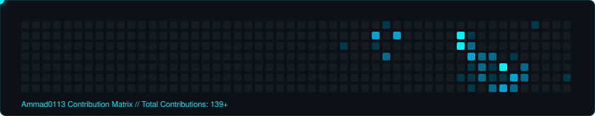

<div align="center">

  <!-- LIGHT PURPLE HEADER BANNER -->
  

  <!-- DYNAMIC TERMINAL TYPING CONSOLE (NO EMOJIS) -->
  <a href="https://ammad-qaiser-portfolio.vercel.app">
    +Software+Engineering+Intern+at+Folio3+Software;>+Research+Intern+at+TUKL+Lab%2C+NUST+SEECS;>+BS+Data+Science+at+FAST-NUCES+Islamabad;>+Deep+Learning+%E2%80%A2+Full-Stack+AI+%E2%80%A2+Computer+Vision;>+Available+for+Software+Engineering+%26+AI%2FML+Roles" alt="Terminal Console" />
  </a>

  <br/><br/>

  <!-- STATUS AND SOCIAL BADGES (NO EMOJIS) -->
  <p align="center">
    <a href="mailto:ammadqaiser0113@gmail.com">
      
    </a>
    <a href="https://ammad-qaiser-portfolio.vercel.app">
      
    </a>
    <a href="https://www.linkedin.com/in/ammadqaiser">
      
    </a>
    
  </p>

</div>

---

### Executive Summary

```yaml
profile:
  name: "Ammad Qaiser"
  domain: "Data Science, Machine Learning & Full-Stack AI Engineering"
  education: "FAST-NUCES Islamabad (BS in Data Science, CGPA 3.00)"
  experience:
    - organization: "Folio3 Software"
      role: "Software Engineering Intern"
      scope: "Full-stack web development, production frameworks, code reviews & agile workflows"
    - organization: "TUKL Lab, NUST SEECS"
      role: "Research Intern"
      scope: "Urdu Handwritten Character Recognition using CNN architectures & data augmentation"
  core_competencies:
    - "Deep Learning & Neural Architectures (CNNs, MLPs, Sequence Models)"
    - "Full-Stack Development (Next.js, React, FastAPI, Node.js, PostgreSQL)"
    - "High-Performance Computing (OpenMP, MPI, Parallel Systems)"
    - "NLP Pipelines & Information Extraction"
  status: "Available for Software Engineering, Data Science & AI/ML Roles"
```

Data Scientist and Software Engineer with industry experience at **Folio3 Software** building production full-stack web applications in agile environments, combined with laboratory research at **TUKL Lab (NUST SEECS)** optimizing Convolutional Neural Networks for non-Latin script recognition. Experienced in designing neural network pipelines, high-performance parallel computing with MPI/OpenMP, and relational databases.

---

### Technical Stack

<div align="center">

#### Machine Learning & Deep Learning
<p>
  
  
  
  
  
  
  
</p>

#### Programming Languages
<p>
  
  
  
  
  
  
  
  
</p>

#### Full-Stack Web & Backend
<p>
  
  
  
  
  
  
</p>

#### High-Performance Systems & Engineering Tools
<p>
  
  
  
  
  
  
  
  
  
</p>

</div>

---

### Featured Repositories

<table>
  <thead>
    <tr>
      <th width="35%">Repository</th>
      <th width="45%">Description & Architecture</th>
      <th width="20%">Link</th>
    </tr>
  </thead>
  <tbody>
    <tr>
      <td>
        <b>Efficient-Earnings-Call-Summarization-Risk-Extraction</b><br/>
        <code>Python</code> <code>NLP</code> <code>OpenMP</code> <code>MPI</code> <code>C</code>
      </td>
      <td>
        High-performance financial intelligence pipeline. Combines parallel OpenMP thread scaling and load-balanced MPI across nodes to process corporate earnings calls, extract risk markers, and compute risk metrics.
      </td>
      <td>
        <a href="https://github.com/Ammad0113/Efficient-Earnings-Call-Summarization-Risk-Extraction">
          
        </a>
      </td>
    </tr>
    <tr>
      <td>
        <b>Deep-Learning-Project-</b><br/>
        <code>TensorFlow</code> <code>Keras</code> <code>CNN</code> <code>MLP</code>
      </td>
      <td>
        Predictive deep learning models for cardiovascular risk assessment. Formulated and benchmarked multi-layer perceptron (MLP) and convolutional architectures on clinical datasets.
      </td>
      <td>
        <a href="https://github.com/Ammad0113/Deep-Learning-Project-">
          
        </a>
      </td>
    </tr>
    <tr>
      <td>
        <b>AI-Project-AeroNet</b><br/>
        <code>Python</code> <code>A* Pathfinding</code> <code>Demand Forecasting</code>
      </td>
      <td>
        AI-driven autonomous drone logistics emulator using A* heuristic pathfinding for obstacle avoidance and machine learning demand prediction for battery-efficient fleet dispatching.
      </td>
      <td>
        <a href="https://github.com/Ammad0113/AI-Project-AeroNet">
          
        </a>
      </td>
    </tr>
    <tr>
      <td>
        <b>Movie-Community-Platform</b><br/>
        <code>Node.js</code> <code>Express</code> <code>MySQL</code> <code>REST API</code>
      </td>
      <td>
        Full-stack relational community platform featuring normalized SQL schemas, user tracking, sentiment moderation, metrics dashboards, and indexed database queries for low-latency retrieval.
      </td>
      <td>
        <a href="https://github.com/Ammad0113/Movie-Community-Platform">
          
        </a>
      </td>
    </tr>
    <tr>
      <td>
        <b>COAL-Project-PACMAN</b><br/>
        <code>Assembly x86</code> <code>Hardware Interrupts</code> <code>VGA Memory</code>
      </td>
      <td>
        Arcade game engine built in x86 assembly using hardware interrupt vectors (<code>INT 10h</code>, <code>INT 16h</code>) and direct video buffer memory rendering with real-time ghost navigation logic.
      </td>
      <td>
        <a href="https://github.com/Ammad0113/COAL-Project-PACMAN">
          
        </a>
      </td>
    </tr>
    <tr>
      <td>
        <b>ADVANCED-STATISTICS-PROJECT</b><br/>
        <code>R Language</code> <code>Econometrics</code> <code>Hypothesis Testing</code>
      </td>
      <td>
        Statistical inference and econometric modeling framework in R executing multivariate regression, residual diagnostic plots, heteroscedasticity testing, and predictive interval estimation.
      </td>
      <td>
        <a href="https://github.com/Ammad0113/ADVANCED-STATISTICS-PROJECT">
          
        </a>
      </td>
    </tr>
    <tr>
      <td>
        <b>Smart-Traffic-Intersection-Simulator</b><br/>
        <code>C Language</code> <code>Scheduling</code> <code>Queuing Theory</code>
      </td>
      <td>
        Multi-lane traffic queue simulator built in C, mapping dynamic scheduling metrics, priority queues, and timing adjustments to reduce intersection red-light latency.
      </td>
      <td>
        <a href="https://github.com/Ammad0113/Smart-Traffic-Intersection-Simulator">
          
        </a>
      </td>
    </tr>
    <tr>
      <td>
        <b>The-Network-Emulator</b><br/>
        <code>C++</code> <code>Dijkstra Algorithm</code> <code>FIFO Queues</code>
      </td>
      <td>
        Object-oriented packet routing simulator in C++ utilizing Dijkstra's shortest path algorithm, FIFO queue scheduling, and dynamic topology routing updates.
      </td>
      <td>
        <a href="https://github.com/Ammad0113/The-Network-Emulator">
          
        </a>
      </td>
    </tr>
  </tbody>
</table>

---

### GitHub Activity & Statistics

<div align="center">
  <table border="0" width="100%">
    <tr>
      <td width="50%" align="center">
        
      </td>
      <td width="50%" align="center">
        
      </td>
    </tr>
    <tr>
      <td width="50%" align="center">
        
      </td>
      <td width="50%" align="center">
        
      </td>
    </tr>
  </table>
</div>

---

### Contribution Matrix

<div align="center">
  <picture>
    <source media="(prefers-color-scheme: dark)" srcset="assets/github-contribution-grid-snake-dark.svg">
    <source media="(prefers-color-scheme: light)" srcset="assets/github-contribution-grid-snake.svg">
    
  </picture>
</div>

---

### Professional Experience & Education

<div align="center">

| Organization / Authority | Role & Scope | Period / Status |
| :--- | :--- | :--- |
| **Folio3 Software** | **Software Engineering Intern** — Full-stack web development with modern frameworks, code reviews & agile sprint workflows | *Jun – Aug 2026* |
| **TUKL Lab, NUST SEECS** | **Research Intern** — Urdu Handwritten Character Recognition with CNNs, hyperparameter tuning & data augmentation | *Jul – Aug 2025* |
| **FAST-NUCES Islamabad** | **BS in Data Science (CGPA: 3.00)** — Data Structures, Algorithms, Distributed Systems, ML & Databases | *2023 – Present* |
| **DeepLearning.AI** | **Deep Learning Specialization** (Andrew Ng) — Neural Networks, CNNs & Sequence Models | *Certified* |
| **Google** | **Advanced Data Analytics Professional Certificate** — Machine Learning, Regression & Statistics | *Certified* |
| **FAST-NUCES (NASCON)** | **Data Visualization Award** — Visual Analytics & Business Intelligence | *Awarded* |

</div>

---

### Contact & Connect

<div align="center">

  <p>Available for full-stack engineering, machine learning research, and data science opportunities.</p>

  <a href="mailto:ammadqaiser0113@gmail.com?subject=Opportunity%20Discussion%20-%20Ammad%20Qaiser">
    
  </a>
  <a href="https://www.linkedin.com/in/ammadqaiser" target="_blank">
    
  </a>
  <a href="https://ammad-qaiser-portfolio.vercel.app" target="_blank">
    
  </a>
  <a href="https://github.com/Ammad0113/Ammad0113/blob/main/assets/Ammad_Qaiser_CV_Updated.pdf" target="_blank">
    
  </a>

  <br/><br/>

  <!-- LIGHT PURPLE FOOTER BANNER -->
  

  <sub>Designed for <b>Ammad Qaiser</b> • All Systems Operational • 2026</sub>

</div>
